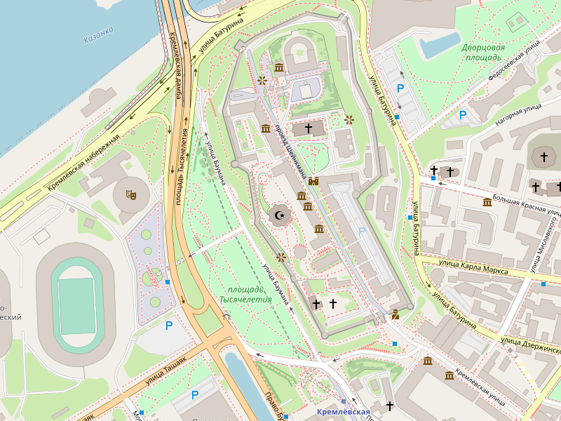

# StaticMap

Генератор статической картинки-карты для заданных географических координат и масштаба.

Может использоваться как сервер, так и отдельная библиотека.

## Библиотека

```go
import "github.com/neonxp/StaticMap/pkg/static"
...
img, err := static.GetMapImage(lat, lon, zoom, width, height)
```
## Сервер

```go
go run *.go
```

В браузере: http://localhost:8000/map?lat=55.798433&lon=49.105191&zoom=16&w=800&h=600

Результат:

